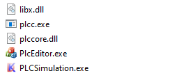
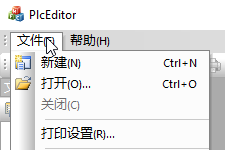
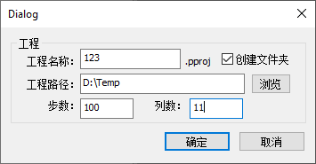
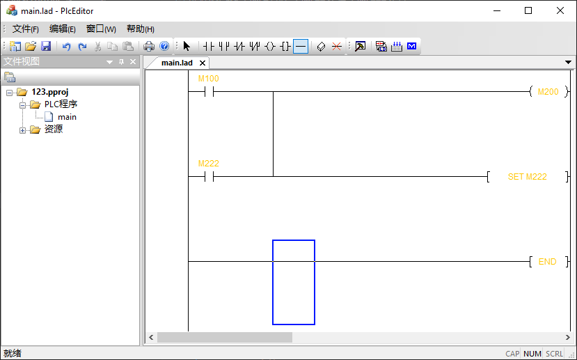
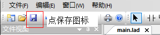
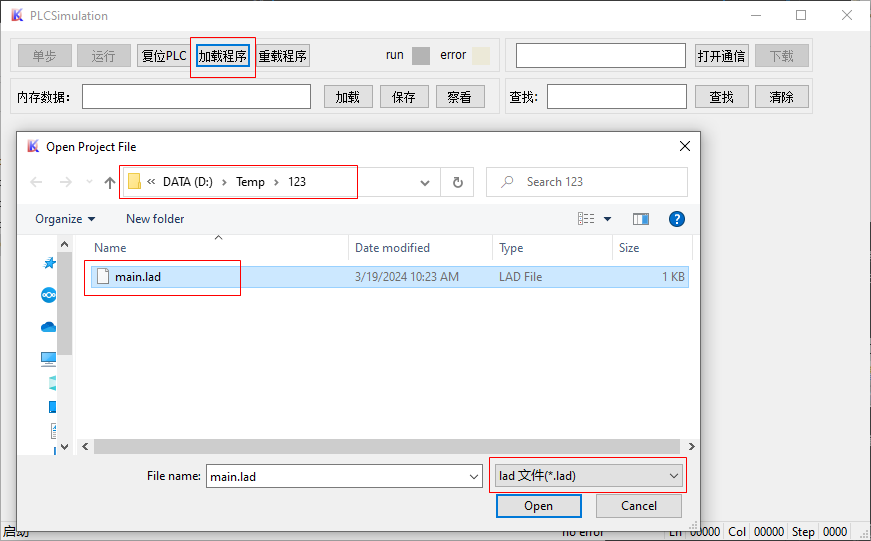
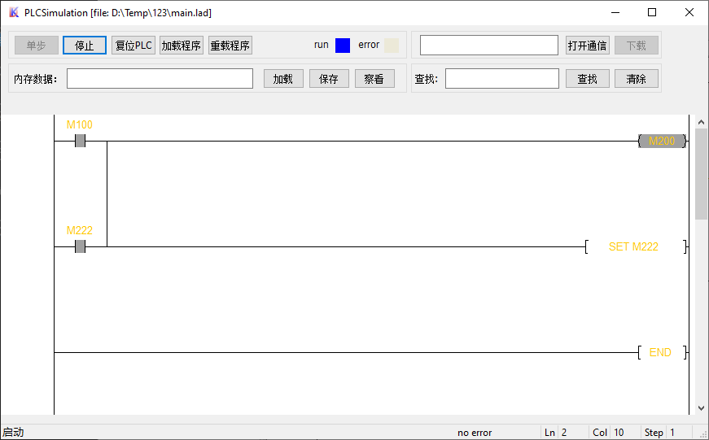

# SPLC
软PLC示例代码，包括windows上位机、windows runtime、stm32 runtime。

由于这个是n年前用于研究软plc，如今也没有维护了，所以代码和功能方面不是很完善。可以下载Relase看看效果。

## 编译
### 上位机和仿真
纯VS工程，使用VS2010打开`sPLC.sln`工程文件，高版本的应该也能打开，包含了上位机和仿真。

### 下位机
STM32的工程在`project/stm32`目录下，使用keil导入即可。

## 运行
上位机和仿真运行方法

- libx.dll          一些辅助方法的库
- plcc.exe          编译器
- plccore.dll       plc runtime
- plcEditor.exe     丑陋的梯形图编辑器
- PLCSimulation.exe plc 在windows下的仿真器

### 上位机
`plcEditor.exe`是梯形图编辑器，只能简单打开保存，没有多余操作。

1. 新建文档

通过【文件】-【新建】来新建文档

2. 设置属性

所有都要填，工程名称随便起，工程路径选一个存在的路径，步数填个100，列数填11。步数和列数可以自己**小心**调整。
设置好了点确定即可。

3. 编辑梯形图

传教好好双击工程树的`main`文档打开编辑`main.lad`。
首先要在最后一行右击弹出菜单选择‘插入新行’，才能编辑。插入多点行再编辑会方便点。

4. 保存梯形图

只能点击保存图标，不要去点转换啥的，时间太久，我也不知有有没有用。点保存就会在工程目录下生成`main.lad`，这个文件就可以下载到plc了。

### 仿真

1. 打开运行文件

运行`PLCSimulation.exe`，点击`加载程序`按钮，弹出对话框，选择刚刚的工程目录，文件类型选`*.lad`,选择生成的`main.lad`文件，点击打开即可。PS：可以选择`*.wpg`来打开三菱工程运行哦，不过应该只支持Fx1N、2N这些上古的型号的工程。

2. 运行lad

打开运行文件后就直接加载梯形图，并显示出来，可以通过双击触点来切换开关状态，对应的逻辑也会刷新。比如双击M100触点导通，M200，M222都会导通，再双击M100触点断开，这时候M200断开，M222还是导通。

3. 单步调试

支持单步调试，首先点击‘停止’按钮，‘单步’按钮会使能，这时候就能点击单步，右下角也会显示当前运行到哪一步。通过单步可以看到梯形图的详细的运行流程

## 在设备上运行plc
plccore是跨平台的，成功在stm32上运行，有需要的自己折腾下哈。

## 结语
这是一个很简单的软plc，实现了基础的运行逻辑，可以对梯形图的翻译和运行有初步的了解，要产品化还需要很多工作。希望能给想做PLC的开发人员提供思路，消除技术壁垒，更多的人能了解PLC，并能实现自己的PLC。

## 广而告之
很庆幸，软PLC这个项目已经在公司落地，当然是全新的项目。新的是符合IEC标准的软PLC平台，已经发布并开始出货。支持完整的梯形图和ST编程，完全自主化，有兴趣的也可以聊聊工作的事情，欢迎高手加入。
